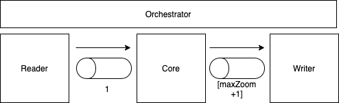

# 4wings - Importer

With this app, you can import your data (from different sources) into your database with the 4wings schema. You can configure your importation with a configuration file.

## Documentation

The importer is divided in 3 steps:

- Reader
- Core
- Writer

### Reader

This step read the data from a source and push the javascript object in a node stream. Each object should have 3 required keys:

- lat: Latitude of the point (in degrees)
- lon: Longitude of the point (in degrees)
- timestamp: String with a date format (ISO8601) (using Date class of Javascript)

The object can have more keys.

#### Available Readers

Now we have 2 available readers:

- CSV: Read data from a CSV. More info [here](./readers/csv/README.md)
- BigQuery: Read data from BigQuery (Google). More info [here](./readers/bigquery/README.md)

#### Custom Reader

If you want to implement your own reader, you only need to follow the next steps:

1. Create a folder in `readers` directory with the name of your new reader
2. The import process will search in your directory a file called `index.ts` with the class that implements the reader interface. You need to create an `index.ts` file
3. This `index.ts` file must implement the [Reader interface](./interfaces/reader.ts)

All readers have 4 methods:

- constructor(options, date, period): When the process creates the writer, it creates the instance with the following parameters:
  - options: Configuration options of the process [more info](#ConfigurationFile)
  - date: the execution date
  - period: the period that we have to execute (daily, monthly, yearly)
- async init(): This method is executed after of create the instance. This is an async method that it can used to initialize the reader.
- async getReadStream(): Promise\<Stream\>: This method should return the stream where the data will send.
- async finish(): This method will be invoked when the stream is closed ant the process is finished.

### Core

This step read the data from the stream and convert it to the 4wings schema. For each object in the stream, the core will generate `maxZoom`+1 objects (You can configure the `maxZoom` value in the configuration file). In other words, if you configure `maxZoom=12`, the writer will receive a array with 13 objects.

Each object will have:

- zoom: Level of zoom
- pos: Value with the tile where the point is. (pos = X + Y \* Math.pow(2, Z))
- cell: Value with the cell inside of the tile where the point is. To calculate this value, it depends of the `cellsByZoom` value configured.
- timestamp: Original timestamp in ISOString format
- htime: Truncate value of the timestamp. Truncate with the value configured in: `heatmap.time`. This value only is in the object, if the configuration file contains values for `heatmap`
- lat: Original latitude
- lon: Original longitude.

The process will also include the keys/columns defined in the `extraColumns` key of the configuration file.

### Writer

This step read the javascript array object from the stream and save it. Remember, each object will be an array with `maxZoom+1` elements.

#### Available Writers

Now we have 4 available writers:

- CSV: Write the data in a file. It creates a file for each level of zoom. More info [here](./writers/csv/README.md)
- Console: Write the data directly in console (Testing purposes). More info [here](./writers/console/README.md)
- Postgres: Write the data in a Postgres database. More info [here](./writers/postgres/README.md)
- Cloudsql: Write the data in a Postgres database managed by Cloud SQL (Google Cloud). More info [here](./writers/cloudsql/README.md)

#### Custom Writer

If you want to implement your own writer, you only need to follow the next steps:

1. Create a folder in `writers` directory with the name of your new reader
2. The import process will search in your directory a file called `index.ts` with the class that implements the writer interface. You need to create an `index.ts` file
3. This `index.ts` file must implement the [Writer interface](./interfaces/writer.ts)

All writers have 4 methods:

- constructor(options, date, period): When the process creates the writer, it creates the instance with the following parameters:
  - options: Configuration options of the process [more info](#ConfigurationFile)
  - date: the execution date
  - period: the period that we have to execute (daily, monthly, yearly)
- async init(): This method is executed after of create the instance. This is an async method that it can used to initialize the writer.
- async getReadStream(): Promise\<Stream\>: This method should return the stream where the data will send.
- async finish(): This method will be invoked when the reader stream is closed ant the process is finished.

## TODO

- [ ] Read configuration for different sources
